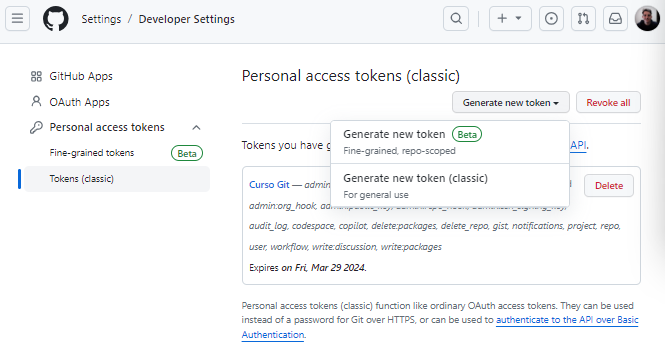

# Git e GitHub
## Configurando o Git

### Git config
Varíavel --global = Config de usuário
Variável --system = Config de sistema
Variável --local = Config do repositório

### Definir nome do user 

git config --global user.name "NomeUser"

#### Para verificar o nome registrado

git config --global user.name

### Definir o email do user

git config --global user.email guilhe1811@gmail.com

#### Para verificar o email registrado

git config --global user.email

### Para definir o nome padrão das branchs

git config --global init.defaultbranch NomeBranch

#### Para verificar a branch padrão

git config init.defaultbranch

### Para verificar todas as configurações

git config --list

(Caso haja a necessidade de ver apenas uma, colocar por exemplo --global antes do --list)

## Acesso por Token

Em alguns momentos, a autenticação pelo GitHub será via Token, uma maneira mais forte para proteger o controle de acesso por senha.

Para criar o token, seguir o diretório da imagem abaixo

Selecionar os acessos permitidos por essa chave.

Ela vai ser criada e deve ser mantida em local seguro, pois é perdida se sair da página.

Ao usar o clone no repositório, inserir o seu user do GitHub e o Token fornecido.

### Para deixar o token salvo:

Após realizar o clone, o comando store deixa salvar o token nas configurações

git config --global credential.helper store

Se a máquina for compartilhada, pode salvar apenas no cache

git config --global credential.helper cache

### Para ver onde uma configuração específica está armazenada

git config --global --show-origin credential.helper¹ 

¹ = Nome da variavel de configuração

.git-credentials = Arquivo onde o Token fica salvo

### Para remover a credencial do gitHub

Ir no gerenciador de credenciais do windows e apagar as credenciais do GitHub