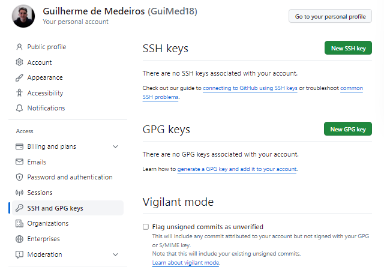

# Git e GitHub
## Credenciais de acesso

### Acesso por Token

Em alguns momentos, a autenticação pelo GitHub será via Token, uma maneira mais forte para proteger o controle de acesso por senha.

Para criar o token, seguir o diretório da imagem abaixo

Selecionar os acessos permitidos por essa chave.

Ela vai ser criada e deve ser mantida em local seguro, pois é perdida se sair da página.

Ao usar o clone no repositório, inserir o seu user do GitHub e o Token fornecido.

#### Para deixar o token salvo:

Após realizar o clone, o comando store deixa salvar o token nas configurações

git config --global credential.helper store

Se a máquina for compartilhada, pode salvar apenas no cache

git config --global credential.helper cache

#### Para ver onde uma configuração específica está armazenada

git config --global --show-origin credential.helper¹ 

¹ = Nome da variavel de configuração

.git-credentials = Arquivo onde o Token fica salvo

#### Para remover a credencial do gitHub

Ir no gerenciador de credenciais do windows e apagar as credenciais do GitHub

### Acesso via SSH

Para entrar na documentação da SSH do GitHub, acessar o diretório conforme imagem

Ao clicar em "connecting to GitHub using SSH keys", a documentação será aberta onde é possível verificar se existem chaves ssh criadas na máquina local, além de outros tópicos

#### Criando uma chave SSH

No Git Bash, colar o comando e substituir o email

ssh-keygen -t ed25519 -C "your_email@example.com"

keygen = Gerador do arquivo da chave
-t = Tipo de algorítmo
ed25519 = Algorítmo
-C = Comentário

Ao dar enter, ele pedirá uma senha opcional, confirmar e prosseguir

Após a criação do arquivo de senha SSH, vamos enviar a chave ao ssh-agent

#### Adicionando chave ao ssh-agent

Seguir a [documentação oficial](https://docs.github.com/pt/authentication/connecting-to-github-with-ssh/generating-a-new-ssh-key-and-adding-it-to-the-ssh-agent#adding-your-ssh-key-to-the-ssh-agent)

Iniciar o serviço do SSH Agent em PoweShell admin

Get-Service -Name ssh-agent | Set-Service -StartupType Manual
Start-Service ssh-agent

Em um cmd sem permissões elevadas, adicionar a chave privada ao agente ssh.

ssh-add c:/Users/Seu_user/.ssh/id_ed25519

Na documentação, é ensinado a ativar o serviço do ssh-agent via powershell, e adicionar a chave privada ao
ssh-agent 

#### Adicionando chave do ssh-agent no gitHub

Seguir o diretório da imagem acima

New SSH KEY -> Adicionar título -> 
Key Type = Authentication Key ->
Key

No campo key, basta darmos um cat no arquivo pub que criamos no processo.

Ex: cat ~/.ssh/id_ed25519.pub

Copiar a chave ssh e colar no campo.

Após realizar o processo, basta usar o clone do git com o link de ssh, será requisitada a senha opcional e clonará normalmente.

