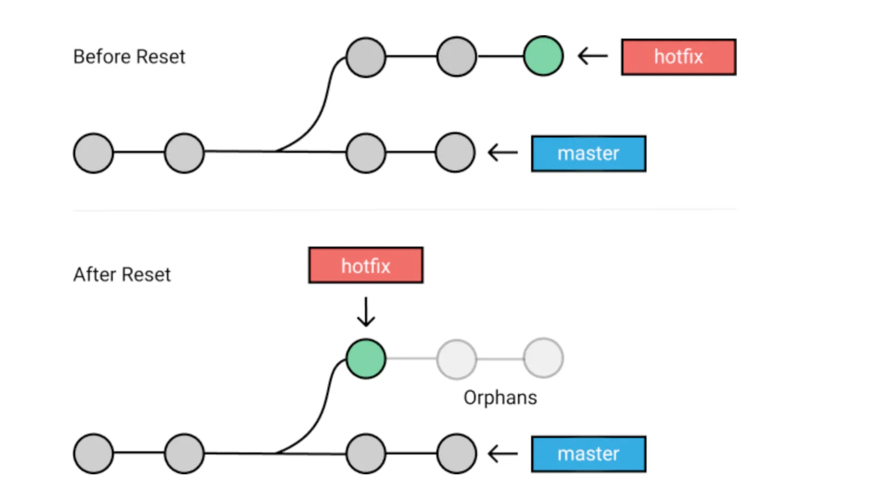

# Git e GitHub
## Desfazendo alterações

### Iniciei um repositório git no lugar errado

cd repositorio
rm -rf .git

### Restaurar um arquivo caso haja feito alguma alteração indevida ou remover da área de Staging

Restaura apenas o último commit
Cuidado ao usar, ele sobrescreve o arq

git restore arquivo

### Corrigir mensagem do commit

#### Último commit:
git commit --amend -m"novo texto" 

### Desfazer o commit

#### Desfaz alterações do commit e retorna os arquivos para staging

git reset --soft hash_do_commit anterior ao que vc quer apagar

#### Desfaz alterações do commit e retorna como arquivo não conhecido

git reset --mixed hash_do_commit anterior ao que vc quer apagar

#### Apaga o arquivo (CUIDADO)

git reset --hard hash_do_commit anterior ao que vc quer apagar

## FluxoGrama do reset

Um exemplo:

1º Alteração inicial
2º Adição de botão
3º Adição de cabeçalho

Quero remover o commit 3º do cabeçalho

git reset --mixed hash do commit número 2º

